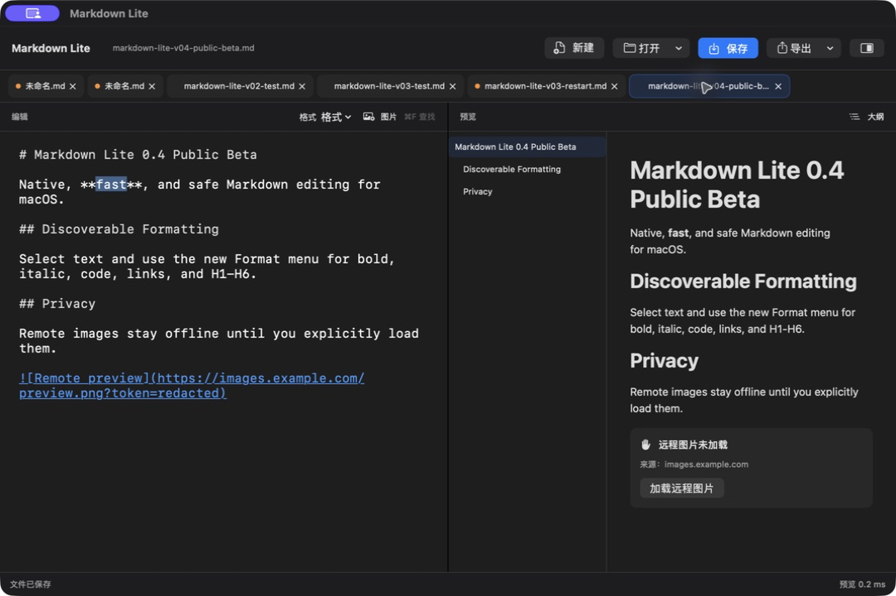

# Markdown Lite

[](https://github.com/nemoob/markdown-lite-mac/actions/workflows/ci.yml)

一个以原生体验、数据安全和可测性能为优先级的 macOS Markdown 编辑器。

> **English:** Markdown Lite is a small, native Markdown editor for macOS, built with SwiftUI and AppKit. It focuses on fast editing, local-first data handling, crash recovery, and practical HTML publishing.

本源码对应 v0.11.0，适合从源码构建和参与开发；当前公开 Beta 以
[GitHub Releases](https://github.com/nemoob/markdown-lite-mac/releases) 中最新 prerelease 为准。项目主页：
[github.com/nemoob/markdown-lite-mac](https://github.com/nemoob/markdown-lite-mac)。

## 功能

- 原生 `NSTextView` 编辑，支持输入法、查找替换、撤销和长文输入。
- 在可安全识别的无序、有序和任务列表行按 `Return`，可延续原标记及缩进；有序编号自动递增，新任务重置为未完成，空列表项退出列表。输入法组合、文本选区和代码围栏内继续使用系统原生换行。
- 增量 Markdown 语法着色；可调字号、行距，并提供常用格式及当前行任务切换快捷键。
- 多标签打开 Markdown/文本文件；可拖拽或用键盘重排标签，并恢复上次标签顺序、活动文档和独立草稿。
- 预览标题、列表、任务列表、引用、代码块、表格、链接及本地图片；任务复选框可同步修改原文，HTTPS 远程图片需逐图确认后加载。
- 标题大纲跳转；每个标签保留独立编辑状态，预览随当前标签实时更新。
- 状态栏显示当前标签的字符数、行数和非空选区字符数；Unicode 全文统计与选区统计都在可取消后台任务中完成。
- 只有活动标签自动生成预览；超过 5 MiB 的文档默认暂停自动预览，并保留一次性手动刷新入口。
- 将拖入或粘贴的图片保存到文档同级 `assets/`，正文使用相对路径；预览只读取文档目录内图片，并以有界后台缩略图控制内存和输入延迟。
- 无损识别常见文本编码，保留 BOM，并以原子写入方式保存文件。
- 用内容指纹和 macOS 文件协调检测外部改写；普通保存不会静默覆盖磁盘版本。
- 草稿记录编辑起点的磁盘指纹，退出重启后仍能识别并阻止外部版本覆盖。
- 工作区会话与本地恢复草稿都使用 `current` 与 `previous` 两代槽位原子轮换；`current` 损坏或缺失时，只回退到最近一份有效的 `previous`，草稿还必须严格匹配同一文档身份。
- 文档成功保存、重载或明确丢弃后会同时清理草稿两代，过期任务不会复活旧草稿；从上一代恢复或双代失败都会在界面明确提示。
- 会话双代都不可恢复时，可以先在 Finder 中查看证据，再将原始文件和拟重建状态归档后恢复当前内存工作区；重建时不会删除 `previous` 原槽位，后续普通保存才按双代规则轮换，归档或重建失败不会静默删除原数据。
- 正常启动使用本地单写者锁；第二实例不会进入工作区写入，避免开发版、命令行实例和应用包同时覆盖同一恢复目录。
- 导出包含安全本地图片的离线单文件 HTML，或复制“简洁”“技术文”两种公众号内联样式；导出结果默认不自动加载远程图片，单图上限 25 MiB、累计上限 100 MiB。
- 内置文档、会话、双代恢复、资源、导出和 Markdown 性能自检。

## 系统要求

- macOS 14 或更高版本
- Swift 6 工具链；推荐使用 Xcode 16 或更新版本
- 不依赖第三方 Swift Package

## v0.11 发布与下载边界

- 源码可在满足上述要求的 Mac 上自行构建，SwiftPM 会为当前主机架构生成可执行文件。
- v0.11 作为只附源码归档、不上传本地或 CI 应用包的 prerelease；公开版本以 GitHub Releases 中的最新版本为准。
- v0.11 的本地与 CI 打包产物目前只验证 Apple Silicon（arm64）；尚未提供经过验证的 Intel 或 Universal 2 应用包。
- `Scripts/package-app.sh` 生成的是本地 ad hoc 签名产物，未经过 Developer ID 签名或 Apple 公证，不能作为正式下载发布。
- 正式预编译下载必须单独完成 Developer ID 签名、公证和下载后验收；在此之前请使用源码构建。

## 构建与运行

```bash
swift build --disable-sandbox -Xswiftc -warnings-as-errors
swift run --disable-sandbox MarkdownLiteMac
```

一次执行格式、严格构建、标准测试和完整自检：

```bash
bash Scripts/check.sh
```

单独运行完整自检：

```bash
swift run --configuration release --disable-sandbox MarkdownLiteMac --self-check
```

单独执行 SwiftPM 测试入口：

```bash
swift test --disable-sandbox --no-parallel -Xswiftc -warnings-as-errors
```

`Scripts/check.sh` 会在本机仅选择 Command Line Tools、但已安装标准 Xcode 时自动使用 Xcode 工具链。标准 SwiftPM 测试串行覆盖文件冲突保护、既有回归和完整基准样本；独立的 release 测试进程执行工作区端到端性能门禁，随后由 release `--self-check` 输出并强制验证其余可复核性能数据。

生成本地 `.app`：

```bash
bash Scripts/package-app.sh
open dist/MarkdownLiteMac.app
```

脚本会生成 release 可执行文件、标准应用目录和本地图标，并执行可复现的本地 ad hoc 签名。该产物仅用于本地开发和验证，不得直接上传为 GitHub Release 的正式下载。

## 架构

生产代码保持单一 SwiftPM executable target，并使用独立 test target 覆盖回归；源码按职责拆分：

| 层次 | 主要职责 |
| --- | --- |
| `ContentView`、`NativeTextEditor` | SwiftUI 界面与 AppKit 原生编辑器桥接 |
| `WorkspaceModel`、`EditorModel` | 多标签生命周期、活动文档和每文档状态 |
| `MarkdownEngine`、`OutlineSupport`、`EditorFormattingSupport` | Markdown 解析、格式命令、增量着色和标题大纲 |
| `DocumentSupport`、`ExternalChangeSupport`、`SessionSupport` | 编码、原子保存、外部冲突、草稿和会话恢复 |
| `AssetSupport` | 本地图片验证、重名处理及 `assets/` 相对路径 |
| `ExportSupport` | 完整 HTML 与公众号粘贴格式 |

核心原则是让文档状态属于文档对象，让文件系统写入集中在支撑层，并让大文本解析离开主线程。

## 性能

内置基准以线性解析约 200KB 和 1MB 的 Markdown 文档，当前解析器门槛分别为：

- 200KB：小于 50ms
- 1MB：小于 200ms

这些数字只衡量 Markdown 解析器，不代表从键盘输入、语法着色到界面渲染的端到端延迟。CI 使用与最终应用一致的 release 配置，在独立进程中执行完整预热、三次解析中位数和块数校验；标准测试进程负责确定性功能与基准样本完整性。编辑输入采用短延迟合并，解析在后台任务执行，过期结果不会覆盖新正文；长任务列表按可见范围创建控件，本地图最多并发解码两张并在离屏时取消旧任务。智能 `Return` 另有 1MB 文档性能回归用例，release 门槛为 p95 小于 10ms、单次最大值小于 25ms；续写计划阶段不额外复制全文或直接调用完整 Markdown 解析器，无法安全转换时直接回退系统换行。双代恢复也使用 release 独立自检：1MB 草稿轮换中位数小于 100ms、损坏回退中位数小于 50ms，100 标签会话回退中位数小于 20ms；草稿编码与磁盘 IO 仍在输入停顿后的后台任务执行。

v0.11 继续用独立 release 测试进程执行真实工作区门禁：1 个和 10 个 1MB 标签恢复至活动预览完成分别小于 500ms、1.5s，100 个空标签恢复小于 500ms；50MB 文件打开、保存分别小于 1.5s、3s；1MB 输入同步 p95 小于 10ms、单次最大值小于 25ms、预览追平小于 1.5s，整组场景峰值 RSS 小于 1GB。退出路径另要求 10 个 1MB dirty 标签同步刷盘小于 1.5s，并用 Debug 真实应用子进程验证 `SIGKILL` 后重新启动可恢复标签顺序、活动标签和独立草稿；测试子模式不编入 Release，可执行文件另有无测试入口检查。阈值为较慢 CI 保留余量，日志会同时输出实际测量值，便于积累历史后再收紧。

## 隐私

- Markdown 正文、草稿、会话和导出均在本机处理，不上传到项目维护者或第三方服务。
- 会话、恢复草稿、单写者锁和用户明确创建的故障归档均保存在 `~/Library/Application Support/MarkdownLiteMac/`，不会上传。
- 图片导入只写入当前已保存文档同级的 `assets/` 目录。
- 应用没有账号、遥测或云同步功能。
- 远程图片默认不联网：明文 `http` 图片始终阻止，`https` 图片仅在用户点击当前图片的加载按钮后向对应站点发起请求。
- “复制公众号格式”会把生成结果写入系统剪贴板，只有用户随后粘贴时才会交给目标应用。

## 截图



截图使用脱敏示例文档，展示原生编辑、格式菜单、增量语法着色、大纲、实时预览和远程图片默认不联网的确认状态。

## 已知边界

- v0.11 未提供经过 Developer ID 签名、公证和真实下载验收的预编译应用，也没有自动更新。
- 当前本地与 CI 打包验证边界为 Apple Silicon（arm64）；Intel Mac 用户需要从源码构建。
- 会话和恢复草稿只保留 `current` 与 `previous` 两代，提供一代本地故障回退；没有有效上一代，或草稿身份不匹配时无法自动恢复。这不是版本历史、云备份或跨设备同步。
- “归档并重建”只处理会话槽位；它不会自动修复损坏草稿，也不是完整恢复中心。归档目录需由用户自行纳入常规备份策略。
- 内容摘要复核与 `NSFileCoordinator` 能阻止遵循文件协调协议的常规外部修改被静默覆盖，但不承诺对完全不参与文件协调、且恰逢最终原子替换窗口的写入提供操作系统级绝对排他。
- 没有云同步、插件系统或 AI 功能。
- Markdown 解析器优先覆盖日常写作语法，并非完整 CommonMark/GFM 兼容实现。
- 公众号格式需要在目标后台进行真实粘贴验收，不同平台可能继续清理部分样式。

## 参与贡献与安全

问题和功能建议请提交到 [GitHub Issues](https://github.com/nemoob/markdown-lite-mac/issues)。贡献前请阅读 [CONTRIBUTING.md](CONTRIBUTING.md)、[CODE_OF_CONDUCT.md](CODE_OF_CONDUCT.md) 和 [AGENTS.md](AGENTS.md)。安全问题请按 [SECURITY.md](SECURITY.md) 私下报告。

## 许可证

本项目使用 [MIT License](LICENSE)。
